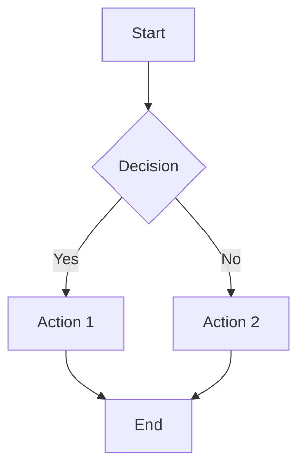
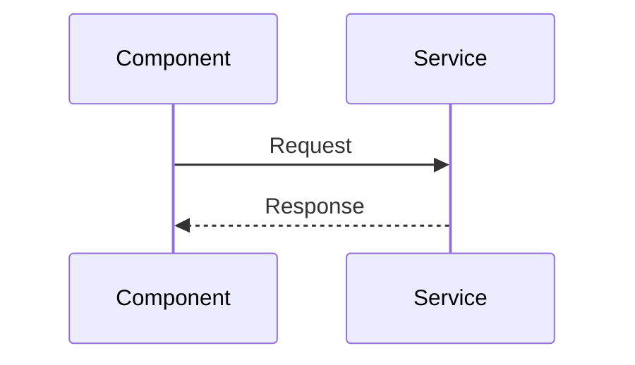
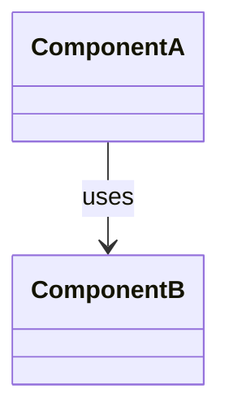

# Mermaid Diagram Generator

📝 **Command:** `@mermaid [filepath]`

**Version:** 1.0.0

AI-powered Mermaid diagram generator for code visualization

## Instructions

When invoked with `@mermaid` (optionally with a file path), automatically (without prompting the user initially):

### 1. Determine File to Analyze

- If a file path is provided as an argument, use that file
- If no file path is provided, use the currently open/focused file from the editor context
- If no file can be determined, ask the user which file to analyze
- Read the entire file content to understand the full context
- If analyzing a directory or multiple files, read all relevant files in that context

### 2. Analyze Code Structure

Examine the code to identify:

- **Component/Class Structure**: Components, classes, functions, and their relationships
- **Data Flow**: How data moves through the system (props, state, function calls)
- **Control Flow**: Conditional logic, loops, async operations, error handling
- **Dependencies**: Imports, exports, and relationships between modules
- **State Management**: State variables, hooks, and state transitions (for React)
- **API/Service Calls**: External dependencies and service interactions

### 3. Determine Diagram Type

Based on the code structure, choose the most appropriate Mermaid diagram type:

- **Flowchart**: For control flow, decision trees, process flows, or general logic flow
- **Sequence Diagram**: For function call sequences, API interactions, or event-driven flows
- **Class Diagram**: For object-oriented code, component hierarchies, or type relationships
- **State Diagram**: For state machines, state transitions, or React component state flows
- **Graph/ER Diagram**: For entity relationships, data models, or dependency graphs

**Default to flowchart if uncertain** - it's the most versatile and readable format.

### 4. Generate Simple, Readable Diagram

Create a Mermaid diagram that is:

- **Simple**: Focus on the most important relationships and flows
- **Easy to Read**: Use clear labels, avoid clutter, limit depth/nodes
- **Focused**: Highlight the main flow or structure, not every detail
- **Well-Formatted**: Use proper Mermaid syntax with appropriate styling

**Diagram Guidelines:**

- Limit nodes to essential elements (aim for 5-15 nodes for readability)
- Use descriptive but concise labels
- Group related elements logically
- Use appropriate shapes (rectangles for processes, diamonds for decisions, etc.)
- Add styling for clarity (colors, shapes) but keep it minimal
- Avoid deep nesting - flatten when possible

### 5. Ask Follow-Up Questions (When Needed)

Before finalizing the diagram, ask the user clarifying questions if:

- The code is complex and multiple diagram types would be useful
- There are multiple flows/paths that could be visualized differently
- Certain parts (e.g., error handling, edge cases) should be included or excluded
- The scope is unclear (single function vs. entire module vs. multiple files)
- There are optional features or conditional paths that may not be needed

**Question Format:**

Ask 1-3 focused questions maximum, such as:

- "Should the diagram include error handling paths?"
- "Do you want to see the full component hierarchy or just the main flow?"
- "Should I include internal helper functions or focus on the public API?"

**If the code is straightforward and the diagram type is clear, proceed without questions.**

### 6. Create Markdown File

Generate a markdown file containing:

- A descriptive title
- Brief context about what the diagram shows
- The Mermaid diagram code block
- Optional: Brief notes about the diagram structure

**File Naming:**

- Save as: `docs/diagrams/<filename>_diagram.md` (create `docs/diagrams/` directory if it doesn't exist)
- Use the source filename (without extension) + `_diagram.md`
- If analyzing multiple files or a directory, use a descriptive name like `module_flow_diagram.md`

**Markdown Format:**

```markdown
# <Descriptive Title>

## Overview

[Brief description of what this diagram visualizes]

## Diagram

\`\`\`mermaid
[Generated Mermaid diagram code]
\`\`\`

## Notes

[Optional: Brief notes about the diagram structure or key elements]
```

### 7. Display the Result

- Show the generated markdown content in the response
- Indicate where the file was saved
- Provide a brief explanation of what the diagram shows

## Key Guidelines

- **Prioritize simplicity and readability** - less is more
- **Choose the right diagram type** for the code structure
- **Ask questions only when necessary** - don't over-prompt
- **Focus on the main flow/structure** - omit implementation details
- **Use clear, concise labels** - avoid technical jargon when possible
- **Create well-structured markdown** that's easy to maintain
- **Handle edge cases gracefully** - if code is too complex, suggest breaking it down
- **Support multiple file analysis** when the context spans multiple files
- **Validate Mermaid syntax** - ensure the generated diagram will render correctly

## Example Diagram Types

### Flowchart Example (Most Common)



### Sequence Diagram Example



### Class/Component Diagram Example



